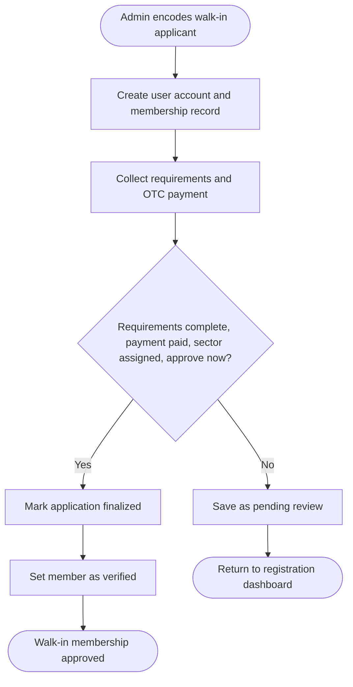
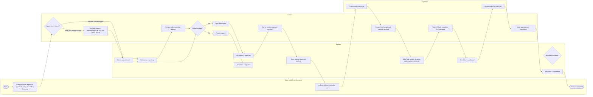
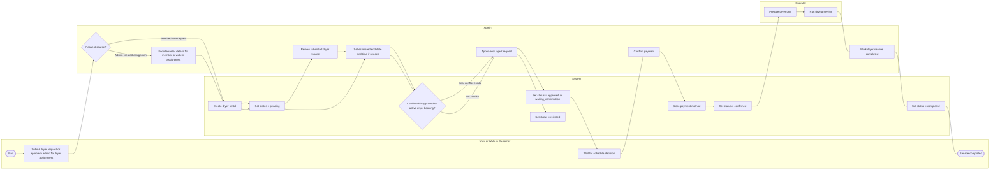
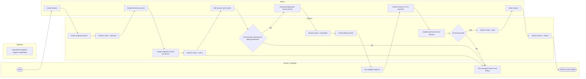
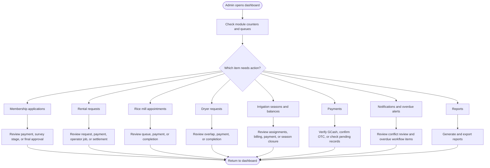

# BUFIA Admin System Flowchart

This document is a defense-ready, code-aligned summary of the important admin-side system processes in the BUFIA Management System.

It is based on the current implementation in the project, not only on conceptual requirements. That means the stages, decisions, and status names below are aligned with the actual codebase.

## 1. Scope

The admin-side workflow covers these important processes:

- Membership application and walk-in membership processing
- Equipment rental approval, payment, operator assignment, and completion
- Rice mill scheduling and payment confirmation
- Dryer service approval and completion
- Irrigation season creation, billing, payment, and closure
- Payment verification and monitoring
- Notifications, reports, and admin dashboard tracking

## 2. Verified System Workflow States

These are the most important workflow states currently used by the system.

### Membership application

- `submitted`
- `ready_for_survey`
- `surveyed`
- `finalized`
- `rejected`

Related payment states:

- `pending`
- `paid`
- `waived`

### Equipment rental

- `requested`
- `approved`
- `ready_for_payment`
- `ready_for_operation`
- `in_progress`
- `overdue`
- `conflict_review`
- `harvest_report_submitted`
- `completed`
- `cancelled`

Related payment and settlement states:

Payment status:

- `pending`
- `paid`
- `paid_in_kind`

Settlement status:

- `waiting_for_delivery`
- `partially_settled`
- `paid`

### Rice mill service

- `pending`
- `approved`
- `paid`
- `confirmed`
- `completed`
- `rejected`
- `cancelled`

### Dryer service

- `pending`
- `waiting_confirmation`
- `approved`
- `paid`
- `confirmed`
- `in_progress`
- `completed`
- `rejected`
- `cancelled`

### Irrigation season management

- `planned`
- `active`
- `harvested`
- `paid`
- `closed`

## 3. Important Defense Notes

Use these points if the panel asks whether the documentation matches the real system.

1. Membership approval is not a single-click process. It has three major admin checkpoints: payment confirmation, survey preparation/result recording, and final approval.
2. In the current codebase, membership survey completion is recorded through the admin membership review workflow. If field personnel physically conduct the survey, the result is still finalized in the admin review screen.
3. Admin-created walk-in equipment rentals are treated differently from member bookings:
   - same-day booking is allowed for walk-ins
   - non-member walk-ins must use over-the-counter payment
   - GCash is not available for non-member walk-ins
4. Rice mill supports admin-encoded bookings, including walk-in customers, with over-the-counter payment enforced for non-member walk-ins.
5. Dryer rentals also allow admin-encoded renter details for service assignment. In the current implementation, admin-created dryer bookings are stored as over-the-counter payment.
6. Irrigation is now season-based. Farmers are assigned by admin to a cropping season, billing is generated after harvest timing, and the season is closed only after records are settled.
7. Equipment rental has a deeper workflow than a simple pending/approved/completed process because it also tracks operator work, overdue items, conflict review, and non-cash settlement after harvest.

## 4. Membership Application System Flow

This is the most important corrected process for defense because it reflects the actual multi-step approval flow.

```mermaid
flowchart LR
    subgraph U[User]
        U1([Start])
        U2[Create account]
        U3[Submit membership form and documents]
        U4{Payment method?}
        U5[Pay online]
        U6[Present slip and pay OTC]
        U7([Wait for updates])
        U8([Membership approved])
        U9([Application rejected])
    end

    subgraph S[System]
        S1[Create membership application]
        S2[Set workflow_status = submitted]
        S3[Set payment_status = pending]
        S4{Payment recorded as paid?}
        S5[Lock approval until payment is complete]
        S6[Set workflow_status = ready_for_survey]
        S7[Notify applicant that survey is needed]
        S8[Set workflow_status = surveyed]
        S9[Notify applicant waiting for final approval]
        S10[Set workflow_status = finalized]
        S11[Set user as verified member]
        S12[Send approval notification]
        S13[Set workflow_status = rejected]
        S14[Send rejection notification]
    end

    subgraph A[Admin]
        A1[Review submitted application]
        A3[Confirm OTC payment or wait for online completion]
        A4[Check documents and land proof]
        A5[Assign sector]
        A6[Assign RCBA number]
        A7[Approve for survey]
        A8[Review survey result]
        A9{Survey result acceptable?}
        A10[Record surveyed farm size and notes]
        A11[Finalize membership approval]
        A12[Reject application]
    end

    subgraph O[Operator or Field Validation]
        O1[Conduct field validation if needed]
        O2[Provide survey findings to admin workflow]
    end

    U1 --> U2 --> U3 --> S1 --> S2 --> S3 --> U4
    U4 -->|Online| U5 --> S4
    U4 -->|OTC| U6 --> A3 --> S4
    S4 -->|No| S5 --> U7
    U7 --> S4
    S4 -->|Yes| A1 --> A4 --> A5 --> A6 --> A7 --> S6 --> S7
    S7 --> O1 --> O2 --> A8
    A8 --> A9
    A9 -->|No| A12 --> S13 --> S14 --> U9
    A9 -->|Yes| A10 --> S8 --> S9 --> A11 --> S10 --> S11 --> S12 --> U8
```

### Membership walk-in shortcut

Walk-in membership may be shorter than the normal applicant flow.

## 5. Equipment Rental System Flow

This process is important because it includes member bookings, walk-in bookings, payment restrictions, operator assignment, and completion.

```mermaid
flowchart LR
    subgraph U[User or Walk-in Customer]
        U1([Start])
        U2[Submit rental request]
        U3[Choose machine and schedule]
        U4[Complete payment when required]
        U5([Receive approval or rejection])
        U6([Rental completed])
    end

    subgraph S[System]
        S1[Create rental record]
        S2[Set workflow_state = requested]
        S3{Walk-in admin booking?}
        S4[Allow same-day booking]
        S5[Require at least 1 day advance]
        S6{Machine available and no blocking conflict?}
        S7[Set status = approved]
        S8[Track payment method and payment status]
        S9[Set workflow_state = in_progress after payment or handover]
        S10{In-kind settlement flow?}
        S11[Set workflow_state = harvest_report_submitted]
        S12[Settlement paid and rental completed]
        S13[Set workflow_state = completed]
        S14[Set workflow_state = rejected or cancelled]
        S15[Flag overdue or conflict_review when needed]
    end

    subgraph A[Admin]
        A1[Review request from dashboard]
        A2{Renter type?}
        A3[Create walk-in rental]
        A4[Review member rental]
        A5{Walk-in non-member?}
        A6[Force OTC payment]
        A7[Approve or reject request]
        A8[Verify GCash or record OTC payment]
        A9[Assign operator]
        A10[Monitor in-progress rental]
        A11[Validate operator completion]
        A12[Verify harvest report or rice-share settlement]
    end

    subgraph O[Operator]
        O1[Receive assigned job]
        O2[Travel and operate machine]
        O3[Mark work completed]
        O4[If in-kind, submit harvest report]
    end

    U1 --> U2 --> U3 --> S1 --> S2 --> A1 --> A2
    A2 -->|Walk-in| A3 --> S3
    A2 -->|Member or regular user| A4 --> S3
    S3 -->|Yes| S4 --> A5
    S3 -->|No| S5 --> S6
    A5 -->|Yes| A6 --> S6
    A5 -->|No| S6
    S6 -->|No| A7 --> S14 --> U5
    S6 -->|Yes| A7 --> S7 --> S8
    S8 --> A8
    A8 --> U4 --> S9 --> A9 --> O1 --> O2 --> O3 --> A10 --> A11 --> S10
    S10 -->|No| S13 --> U6
    S10 -->|Yes| O4 --> S11 --> A12 --> S12 --> U6
    S9 --> S15
```

### Rental defense points

1. Member and user rentals are advance bookings.
2. Admin walk-in rentals can be same-day.
3. Non-member walk-ins cannot use GCash.
4. Overdue rentals can trigger `overdue` and `conflict_review` states.
5. In-kind rentals are completed only after harvest report verification and settlement confirmation.

## 6. Rice Mill Service Flow

### Rice mill defense points

1. Rice mill can accept multiple appointments on the same day for planning purposes.
2. The final amount depends on the final recorded weight.
3. Admin can also encode walk-in appointments directly.
4. Walk-in rice mill bookings are over-the-counter only.
5. Payment confirmation happens after the amount is known.

## 7. Dryer Service Flow

### Dryer defense points

1. Dryer requests are checked against schedule overlap before approval.
2. Admin may need to set estimated completion timing.
3. Admin can encode the renter details directly when creating a dryer assignment for a member or walk-in customer.
4. In the current implementation, admin-created dryer bookings are treated as over-the-counter payment.
5. Completion happens only after payment confirmation and service execution.

## 8. Irrigation Season and Billing Flow

This is not a simple request-approval flow anymore. It is a season-management process.

### Irrigation defense points

1. Irrigation is season-based, not open-ended per-request scheduling.
2. Admin assigns members to a cropping season by sector.
3. Billing is generated after harvest timing is reached.
4. A season closes only when all related records are paid or when there are no records to settle.

## 9. Admin Oversight Flow

This summarizes what the admin continuously monitors in the dashboard.

## 10. Suggested Defense Script

You can explain the system like this:

1. The admin enters the dashboard and sees operational queues for memberships, rentals, payments, and seasonal records.
2. Membership is processed in stages: submitted, ready for survey, surveyed, then finalized.
3. Equipment rental has separate logic for members and walk-ins, including payment restrictions for non-member walk-ins.
4. Operator involvement is strongest in equipment operations and service execution, while admin remains responsible for approval, payment confirmation, and final completion.
5. Rice mill supports admin-created walk-in appointments, while dryer supports admin-encoded renter assignments that can also represent walk-in service.
6. Rice mill and dryer services both require admin approval, payment confirmation, and completion tracking.
7. Irrigation is managed through cropping seasons, farmer assignment, billing generation, payment confirmation, and season closure.
8. The system also supports monitoring of overdue rentals, conflict review, notifications, and report generation for management decisions.

## 11. Recommended Figure Titles

Use these in your capstone or slide deck:

- **Figure X. Code-Aligned Admin System Workflow of the BUFIA Management System**
- **Figure Y. Membership Application Approval Workflow**
- **Figure Z. Equipment Rental Approval, Payment, and Completion Workflow**
